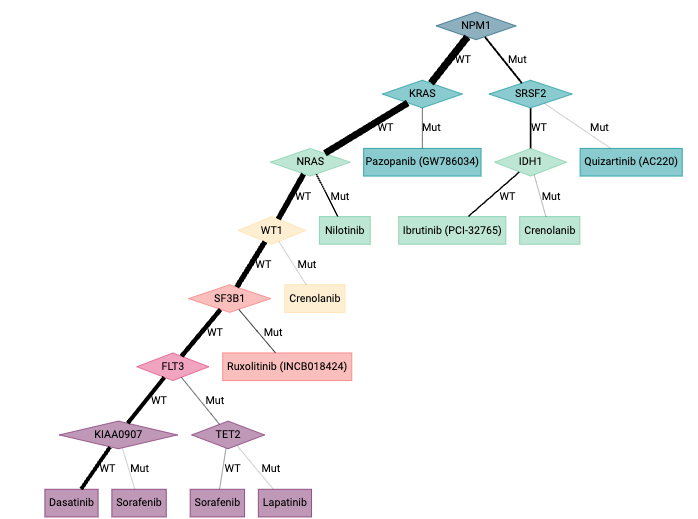
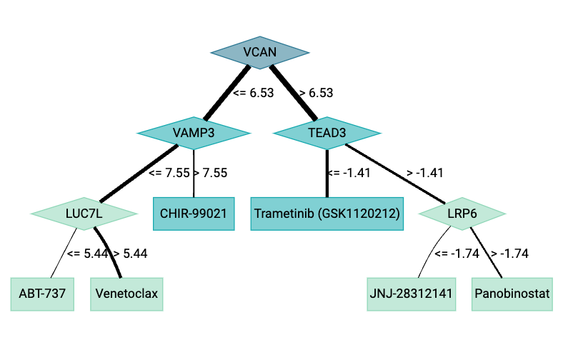

```{r LoadFunctions, echo=FALSE, message=FALSE, warning=FALSE, results='hide'}
library(knitr)
library(ODT)
opts_chunk$set(error = FALSE)
library(partykit)
library(rmarkdown)
library(DiagrammeR)
```

------------------------------------------------------------------------

## Abstract

*ODT* is an R package that is based on an algorythm known as Optimal Decision Tree (ODT). This algorithm works for personalized medicine field, employing novel methods that consist of the usage of tree-shaped methods in order to asign the best treatment for each patient taking into account genomic or mutational data from each patient.

------------------------------------------------------------------------

# Installation

ODT can be installed from CRAN repository:

```{r, eval=FALSE}

install.packages("ODT")

```


# Introduction

As mentioned before, unlike other personalized medicine algorithms that are based on classification or regression trees, ODT works by solving optimization problems. To understand the process, ODT has as arguments each patient's reactivness to different drugs (sensitivity data) and genomic or mutational data. The algorithm chooses a splitting variable (which could be a gene or a type of mutation depending on the arguments of the data being studied) and the treatments for each split. For that, ODT optimizes a measure of sensitivity of both branches to the selected treatments (for example employing IC50 data). In other words, the algorithm assigns each of the patient the best treatment optimizing sensitivity data and splitting patients creating an optimial decision tree.

The package library has three main parts:

-   Training the model: Given mutational or genomic data the model is trained before making predictions.
-   Optimal treatment assignation: After training the model to study the given data from the patients and taking into account the drug responses, it predicts the optimal treatment for each case.
-   Plotting the decision tree: After splitting the patients and assigning treatments,the graphical display of the tree and the possibility to export it.


Figure 1 is a flowchart that depicts *ODT* pipeline. Given data from different patients that could be a binary matrix containing mutational data (whether the mutation is present or not in the patient) or a matrix containing gene expression levels the tree is trained with this data.

Later on, taking into account patient's sensitivity or drug response to different treatments, the trained tree starts splitting the patients by choosing the optimal genomic or mutational split. Later on, the algorithm chooses the optimal biomarker for each branch of the tree before making another split. That is to say, the tree chooses the best treatment for both patient groups. The tree continues splitting the patients in different branches and assigning treatments until a minimum patients number is reached on the nod of the tree (where splitting the data furthermore is not possible).\
Seeing the process of the algorithm applied to the ODT package, we have three main functions that will picture the algorithm's work; let's see an overview:

-   **`trainTree`** if the user wants to train the tree with the data from patients mutations or genetic expression beforehand.
-   **`predictTree`** if the user wants to get the optimal treatment for each patient given the trained tree, the expression or mutational data and the drug response data from the patients.
-   **`niceTree`** will be used when the user wants to obtain the tree of splits graphicaly. The user will also have the chance to download this plot to a choosen directory given different formats for the image.


# Example employing mutational data:

Given a binary matrix mut_small with the mutation information and a drug response matrix drug_small of the patients chosen we are going to study how we can apply the ODT package employing data retrieved from examples.During this example we have selected a small number of patient data (IC50 data and mutational data) that we are going to use as arguments.

First, we will train the tree beforehand with the data we have selected, using the *trainTree* function for that, the inputs for this function will be:

-   **PatientData:** The binary matrix with the mutation information.
-   **PatientSensitivity:** The matrix with the drug response information.
-   **minbucket** Fixed parameter that sets the minimum number of patients that are needed on a branch of the tree in order to make a split.


```{r, eval=FALSE}

#ODT_MUT<-trainTree(PatientResponse = mut_small,PatientSensitivity=drug_small, minbucket =1)

```


The output of the function will be a tree with the splits that the ODT algorithm has performed given the mutational and sensitivity data and the treatments chosen for each of the splits. In order to see graphically the optimal tree acquired, we will use the *niceTree* function. This function will show us the mutations chosen in each nod and the treatment selected for each branch (for the branch of the splits that has the mutation and for the one that doesn't). The necessary input will be:

-   **tree:**The trained tree we have previously acquired by calling the trainTree function
-   **folder:**The folder directory where the image wants to be saved

There will be other fixed parameters that the user will have the chance to modify, related to the style of the plot:

-   **colors, fontname, fonstyle, shape, output_format\***

For more information on the preferences of the plot go to the niceTree function explanation.


```{r, eval=FALSE}

#niceTree(tree=ODT_MUT, folder=NULL)

```

Finally, in order to know what treatment has been selected for each specific patients we will call the *predictTree* function. This function will tell us what treatment has been selected by the algorithm for each patient. For that we will need the next arguments:

-   **tree:**The trained tree we have previously acquired by calling the trainTree function
-   **PatientData:** The binary matrix with the mutation information.
-   **PatientSensitivity:** The matrix with the drug response information.

The following code chunk shows an example of how to perform this function:


```{r, eval=FALSE}

library(ODT)
data("mutations_w34")
data("drug_response_w34")
mut_small<-mutations_w34[1:3,1:3]
drug_small<-drug_response_w34[1:3,1:3]

ODT_MUT<-trainTree(PatientData = mut_small,PatientSensitivity=drug_small, minbucket =1)

niceTree(ODT_MUT)

ODT_MUTpred<-predictTree(tree=ODT_MUT, PatientSensitivity=drug_small, PatientData=mut_small)
names_drug<-colnames(drug_small)
names_drug[ODT_MUTpred]

```





# Example employing genomic data:

Given a matrix gen_small with the gene expession information and a drug response matrix drug_small of the patients chosen, we are going to study how we can apply the ODT package employing data retrieved from examples. During this example we have selected a small number of patient data (IC50 data and genomic data) that we are going to use as arguments.

First, we will train the tree beforehand with the data we have selected, using the *trainTree* function for that, the inputs for this function will be:

-   **PatientData:** The matrix with the gene expression information.
-   **PatientSensitivity:** The matrix with the drug response information.
-   **minbucket** Fixed parameter that sets the minimum number of patients that are needed on a branch of the tree in order to make a split.

```{r, eval=FALSE}

#ODT_EXP<-trainTree(PatientData = gene_small, PatientSensitivity=drug_small, minbucket =1)

```

The output of the function will be a tree with the splits that the ODT algorithm has performed given the genomic and sensitivity data and the treatments chosen for each of the splits. In order to see graphically the optimal tree acquired, we will use the *niceTree* function. This function will show us the mutations chosen in each nod and the treatment selected for each branch (for the branch of the splits that has the mutation and for the one that doesn't). The necessary input will be:

-   **tree:**The trained tree we have previously acquired by calling the trainTree function
-   **folder:**The folder directory where the image wants to be saved

There will be other fixed parameters that the user will have the chance to modify, related to the style of the plot:

-   **colors, fontname, fonstyle, shape, output_format\***

For more information on the preferences of the plot go to the niceTree function explanation.

```{r, eval=FALSE}

#niceTree(tree=ODT_EXP, folder=NULL)

```

Finally, in order to know what treatment has been selected for each specific patients we will call the *predictTree* function. This function will tell us what treatment has been selected by the algorithm for each patient. For that we will need the next arguments:

-   **tree:**The trained tree we have previously acquired by calling the trainTree function
-   **PatientSensitivity:** The matrix with the drug response information.
-   **PatientData:** The matrix with the genomic information.

The following code chunk shows an example of how to perform this function:

```{r, eval=FALSE}

library(ODT)
data("expression_w34")
data("drug_response_w34")
gene_small<-expression_w34[1:3,1:3]
drug_small<-drug_response_w34[1:3,1:3]

ODT_EXP<-trainTree(PatientData = gene_small, PatientSensitivity=drug_small, minbucket =1)

niceTree(ODT_EXP)

ODT_EXPpred<-predictTree(tree=ODT_EXP, PatientSensitivity=drug_small, PatientData=gene_small)
names_drug<-colnames(drug_small)
names_drug[ODT_EXPpred]

```


# Example Assigning optimal treatment to new patients (Mutational Data)

Given a binary matrix with mutation information and a drug response matrix of the patients, we are going to train a model using ODT package that will be able to predict the best treatment a patient whose sensitivity response to the different treatments is unknown.

```{r, eval=FALSE}

library(ODT)
data("mutations_w34")
data("mutations_w12")
data("drug_response_w12")
data("drug_response_w34")


mut_newpatients<-mutations_w34[1, ,drop=FALSE]


ODT_MUT<-trainTree(PatientData = mutations_w12, PatientSensitivity=drug_response_w12, minbucket =10)

niceTree(ODT_MUT,folder=NULL)

ODT_MUTpred<-predictTree(tree=ODT_MUT, PatientSensitivity=drug_response_w12, PatientData=mut_newpatients)

names_drug<-colnames(drug_response_w12)
names_drug[ODT_MUTpred]


```


# Example Assigning optimal treatment to new patients (Genomic Data)

Given a matrix with gene expression information and a drug response matrix of the patients, we are going to train a model using ODT package that will be able to predict the best treatment a patient whose sensitivity response to the different treatments is unknown.

```{r, eval=FALSE}

library(ODT)
data("expression_w34")
data("expression_w12")
data("drug_response_w12")
data("drug_response_w34")

exp_newpatients<-expression_w34[,1,drop=FALSE]


ODT_EXP<-trainTree(PatientData = expression_w12, PatientSensitivity=drug_response_w12, minbucket =10)

niceTree(ODT_EXP,folder=NULL)

ODT_EXPpred<-predictTree(tree=ODT_EXP, PatientSensitivity=drug_response_w12, PatientData=exp_newpatients)

names_drug<-colnames(drug_response_w12)
names_drug[ODT_EXPpred]

```




# Citation

More information can be found at:

Gimeno M, Sada Del Real K, Rubio A. Precision oncology: a review to assess interpretability in several explainable methods. Brief Bioinform. 2023 Jul 20;24(4):bbad200. doi: 10.1093/bib/bbad200. PMID: 37253690; PMCID: PMC10359088.

# Session Information

```{r}
sessionInfo()
```
